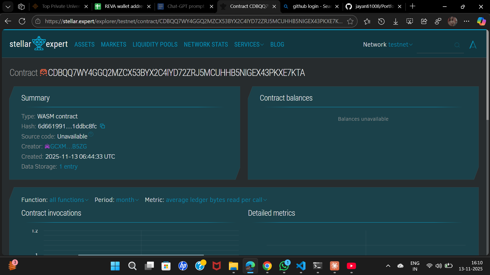

# Portfolio Management Dashboard

## Project Description

A comprehensive blockchain-based portfolio management system built on the Stellar network using Soroban smart contracts. This decentralized application enables users to track and manage multiple Stellar assets and investments in real-time, providing transparency, security, and autonomous control over their investment portfolio.

The smart contract allows users to add assets to their portfolio, update asset prices, view individual asset details, and get an overview of their entire portfolio's performance—all stored immutably on the blockchain.

## Project Vision

Our vision is to democratize portfolio management by providing a transparent, secure, and decentralized platform where investors can:

- **Take Full Control**: Manage their investments without intermediaries
- **Ensure Transparency**: All transactions and holdings are recorded on-chain
- **Access Real-time Data**: Track portfolio performance with up-to-date asset valuations
- **Maintain Privacy**: User data remains secure through cryptographic authentication
- **Build Trust**: Immutable blockchain records ensure data integrity

We envision a future where every investor, regardless of their experience level, can manage their Stellar assets efficiently through a trustless, decentralized system that puts them in complete control of their financial future.

## Key Features

### 1. **Add Asset to Portfolio**
- Users can add new assets to their portfolio with complete details
- Records asset name, code, quantity, and purchase price
- Automatically timestamps each transaction
- Updates portfolio summary in real-time

### 2. **Update Asset Price**
- Enables dynamic price updates for existing assets
- Automatically recalculates total portfolio value
- Maintains historical purchase price for profit/loss tracking
- Requires user authentication for security

### 3. **Portfolio Summary Dashboard**
- Provides comprehensive overview of total holdings
- Displays total number of assets in portfolio
- Shows aggregated portfolio value
- Tracks last update timestamp

### 4. **View Asset Details**
- Retrieves detailed information for specific assets
- Displays purchase price vs. current price
- Shows quantity held and asset metadata
- Enables individual asset performance tracking

### 5. **Decentralized & Secure**
- Built on Stellar blockchain using Soroban SDK
- User authentication through address verification
- Immutable transaction records
- No centralized authority or intermediary

### 6. **Persistent Storage**
- All data stored on-chain with extended TTL (Time To Live)
- Portfolio data persists across sessions
- Reliable and tamper-proof record keeping

## Future Scope

### Phase 1: Enhanced Analytics
- **Performance Metrics**: Add profit/loss calculations, ROI tracking, and historical performance charts
- **Asset Categorization**: Group assets by type (stocks, crypto, bonds, etc.)
- **Multi-currency Support**: Enable portfolio tracking in different fiat currencies

### Phase 2: Advanced Features
- **Automated Price Feeds**: Integration with oracles for real-time price updates
- **Portfolio Rebalancing**: Smart contract functions to suggest or automate portfolio rebalancing
- **Risk Assessment**: Built-in risk analysis and diversification metrics
- **Transaction History**: Complete audit trail of all portfolio changes

### Phase 3: Social & Collaborative Features
- **Portfolio Sharing**: Share portfolio performance with optional privacy controls
- **Copy Trading**: Allow users to mirror successful portfolios
- **Investment Insights**: AI-powered recommendations based on portfolio composition
- **Multi-signature Management**: Enable shared portfolio management for funds or families

### Phase 4: DeFi Integration
- **Yield Farming Tracking**: Monitor returns from DeFi protocols
- **Liquidity Pool Management**: Track LP tokens and impermanent loss
- **Staking Dashboard**: Monitor staking rewards across multiple protocols
- **Cross-chain Portfolio**: Expand beyond Stellar to support multi-chain assets

### Phase 5: Advanced Tools
- **Tax Reporting**: Automated capital gains calculations and tax documents
- **Alert System**: Price alerts and portfolio threshold notifications
- **API Access**: Developer API for third-party integrations
- **Mobile Application**: Native mobile apps for iOS and Android

### Technical Improvements
- **Gas Optimization**: Further optimize contract execution costs
- **Batch Operations**: Enable bulk asset additions and updates
- **Archive System**: Implement asset removal and historical archiving
- **Upgrade Mechanism**: Add upgradeability patterns for future enhancements

---

## Getting Started

### Prerequisites
- Rust and Cargo installed
- Soroban CLI tools
- Stellar account with testnet/mainnet access

### Installation
```bash
# Clone the repository
git clone <repository-url>

# Build the contract
soroban contract build

# Deploy to testnet
soroban contract deploy \
  --wasm target/wasm32-unknown-unknown/release/portfolio_contract.wasm \
  --source <your-secret-key> \
  --network testnet
```

### Usage Examples

```bash
# Add an asset
soroban contract invoke \
  --id <contract-id> \
  --source <your-secret-key> \
  --network testnet \
  -- add_asset \
  --user <your-address> \
  --asset_name "Stellar Lumens" \
  --asset_code "XLM" \
  --quantity 1000 \
  --purchase_price 12

# Get portfolio summary
soroban contract invoke \
  --id <contract-id> \
  --network testnet \
  -- get_portfolio_summary \
  --user <your-address>
```

---

## Contributing

We welcome contributions! Please feel free to submit issues, feature requests, or pull requests to help improve this project.

## License

This project is open-source and available under the MIT License.

---

## Contract Details

CDBQQ7WY4GGQ2MZCX53BYX2C4IYD72ZRJ5MCUHHB5NIGEX43PKXE7KTA
